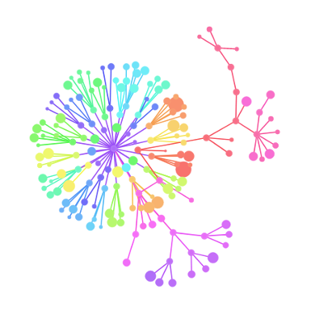

CodeFlower
==========

This experiment visualizes source repositories using an interactive tree. Each disc represents a file, with a radius proportional to the number of lines of code (loc). All rendering is done client-side, in JavaScript. Built with <a href="https://github.com/mbostock/d3">d3.js</a>, inspired by <a href="https://code.google.com/p/codeswarm/">Code Swarm</a> and <a href="https://code.google.com/p/gource/">Gource</a>, published with the MIT open-source license.

Interact with CodeFlowers, see examples, and build your own at [http://fzaninotto.github.com/CodeFlower](http://fzaninotto.github.com/CodeFlower).

